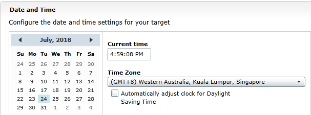
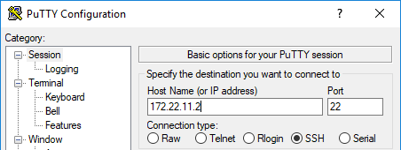

How to use NI ELVIS III with Python
=======
# Overview
In this document we will walk you through the setup, transfer of files, and the use of a Python example on NI ELVIS III. The NI ELVIS III solution for project-based learning can be programmed with python to help students or educators who are familiar with Python syntax to rapidly acquire measurements using common SSH clients. Attached to this file are a total of 18 examples which illustrate the use of the NI ELVIS III helper library ([academicIO.py](source/nielvisiii/academicIO.py)).

# Table of Contents
- [Software Setup](#software-setup)
  * [NI ELVIS III Software Setup](#ni-elvis-iii-software-setup)
  * [Install Prerequisite Software for NI ELVIS III Python](#install-prerequisite-software-for-ni-elvis-iii-python)
  * [Install NI ELVIS III Python](#install-ni-elvis-iii-python)
- [Running the Example](#running-the-example)
- [Function Select Register](#function-select-register)

# Software Setup

## NI ELVIS III Software Setup
In this section we will install the software needed to communicate to the NI ELVIS III and install the required packages to use the Python FPGA API.

1. Install the [NI Measurement Live Support Files](http://www.ni.com/download/labview-elvis-iii-toolkit-2018/7639/en/).
2. Connect the NI ELVIS III to the Internet using the Ethernet Port, Wifi, or USB connection so that the Python libraries can be installed from the Internet. We recommend to use either Ethernet Port or Wifi.
3. Enable the **Secure Shell Server**.
   1. Open Internet Explorer and visit the NI ELVIS III Configuration website: \<IP Address of NI ELVIS III\>/WIF.html<br/>
      <br/>
      Note: IP Address can be found on the Display of the NI ELVIS III. Press BUTTON 0 until IP address appears. Enter IP address from the display.<br />
      
   2. Navigate to thetab at the left of the page if not already there.
   3. Enable **Secure Shell Server (sshd)** checkbox in the **Startup Settings** section.
       
   4. Click **Save**.
4. Setup **Time Configuration**.
   On the NI ELVIS III configuration website:
   1. Click on the  tab at the left of the page .
   2. Configure the **Date**, **Current time**, and **Time Zone** to your current local time.
      
   3. Click **Save**.

## Install Prerequisite Software for NI ELVIS III Python
1. Install and open your favorite SSH client. If you do not have one, we recommend [PuTTY](https://the.earth.li/~sgtatham/putty/latest/w32/putty.exe): 
   - Configure PuTTY or another client as follows:
    
     
        
      - **Host Name**: \<IP Address of NI ELVIS III\>
      - **Port**: 22
      - **Connection Type**: SSH
   - Click **Open**.
   - Once the connection opens Log In as:
       - **login as**: admin
       - **Password**: (Just press Enter. There is no password by default.)
2. Install prerequisite software by running the following commands:<br />
   Note: **Time configuration** must be set before running these commands
   ```
   opkg update
   opkg install python
   opkg install python-pip
   pip install nifpga
   pip install pyvisa
   ```

## Install NI ELVIS III Python
1. Configure GitHub.
   - Generate SSH keys and add to your GitHub account. If you are new to GitHub, you can type `ssh-keygen -t rsa -C "example@email.com"`  on Putty to generate a SSH key and add it to your GitHub account. See [Connecting to GitHub with SSH](https://help.github.com/articles/connecting-to-github-with-ssh/) for more helps.
2. Download the NI ELVIS III Python helper library and Python Example from GitHub.
   - Download NI ELVIS III Python.
     ```
     git clone --recursive git@github.com:ni/NI-ELVIS-III-Python.git
     ```
   - You will see things like this when the download finished successfully. 
     > admin@NI-ELVIS-III-0000000: ~# git clone --recursive git@github.com:ni/NI-ELVIS-III-Python<br/>
     > Cloning into 'NI-ELVIS-III-Python'...<br/>
     > remote: Counting objects: 407, done.<br/>
     > remote: Total 407 (delta 0), reused 0 (delta 0), pack-reused 407<br/>
     > Receiving objects: 100% (407/407), 1.31 MiB | 265.00 KiB/s, done.<br/>
     > Resolving deltas: 100% (263/263), done.<br/>
     > git: 'submodule' is not a git command. See 'git --help'.<br/>

# Running the Example

In the PuTTY client (or similar clients) used in the earlier **Software Setup** session, change the current directory to **NI-ELVIS-III-Python/** (`cd /home/admin/NI-ELVIS-III-Python/`), then enter the following command to run the example:
```
python examples/<example_category>/<example_filename>.py
```
For example: `python examples/analog/AI_singleChannel.py`

# Function Select Register

- DIO:      DIO [0:19] on bank A and bank B
- PWM:      DIO [0:19] on bank A and bank B
- Encoder:  DIO [0:1], DIO [2:3], …, DIO [18:19] on bank A and bank B
- SPI:      DIO [5:7] on bank A and bank B
- I2C:      DIO [14:15] on bank A and bank B
- UART:     DIO [16:17] on bank A and bank B

|**NI ELVIS III**| DIO | PWM | Encoder | SPI | I2C | UART | 
|:--------------:|:-----------:|:-----------:|:---------------:|:-----------:|:------------------------:|:----------:| 
| **DIO 0**      | DIO 0       | PWM 0       | ENC.A 0         |             |                          |            | 
| **DIO 1**      | DIO 1       | PWM 1       | ENC.B 0         |             |                          |            | 
| **DIO 2**      | DIO 2       | PWM 2       | ENC.A 1         |             |                          |            | 
| **DIO 3**      | DIO 3       | PWM 3       | ENC.B 1         |             |                          |            | 
| **DIO 4**      | DIO 4       | PWM 4       | ENC.A 2         |             |                          |            | 
| **DIO 5**      | DIO 5       | PWM 5       | ENC.B 2         | SPI.CLK     |                          |            | 
| **DIO 6**      | DIO 6       | PWM 6       | ENC.A 3         | SPI.MISO    |                          |            | 
| **DIO 7**      | DIO 7       | PWM 7       | ENC.B 3         | SPI.MOSI    |                          |            | 
| **DIO 8**      | DIO 8       | PWM 8       | ENC.A 4         |             |                          |            | 
| **DIO 9**      | DIO 9       | PWM 9       | ENC.B 4         |             |                          |            | 
| **DIO 10**     | DIO 10      | PWM 10      | ENC.A 5         |             |                          |            | 
| **DIO 11**     | DIO 11      | PWM 11      | ENC.B 5         |             |                          |            | 
| **DIO 12**     | DIO 12      | PWM 12      | ENC.A 6         |             |                          |            | 
| **DIO 13**     | DIO 13      | PWM 13      | ENC.B 6         |             |                          |            | 
| **DIO 14**     | DIO 14      | PWM 14      | ENC.A 7         |             | I2C.SCL                  |            | 
| **DIO 15**     | DIO 15      | PWM 15      | ENC.B 7         |             | I2C.SDA                  |            | 
| **DIO 16**     | DIO 16      | PWM 16      | ENC.A 8         |             |                          | UART.RX    | 
| **DIO 17**     | DIO 17      | PWM 17      | ENC.B 8         |             |                          | UART.TX    | 
| **DIO 18**     | DIO 18      | PWM 18      | ENC.A 9         |             |                          |            | 
| **DIO 19**     | DIO 19      | PWM 19      | ENC.B 9         |             |                          |            |
