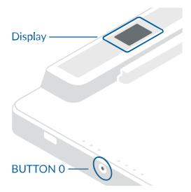
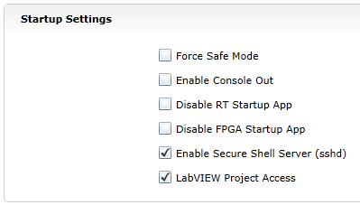

How to use NI ELVIS III with Python
=======
# Overview
In this document we will walk you through the setup, transfer of files, and the use of a Python example on the NI ELVIS III. The NI ELVIS III solution for project-based learning can be programmed with python to help students or educators who are familiar with Python syntax to rapidly acquire measurements by using common SSH clients. Attached to this file are a total of 18 examples which illustrate the use of the NI ELVIS III helper library ([academicIO.py](source/nielvisiii/academicIO.py)).

# Table of Contents
- [Software Setup](#software-setup)
  * [Configuring the NI ELVIS III Device](#configuring-the-ni-elvis-iii-device)
  * [Installing Prerequisite Software for NI ELVIS III Python](#installing-prerequisite-software-for-ni-elvis-iii-python)
  * [Installing NI ELVIS III Python Examples](#installing-ni-elvis-iii-python-examples)
- [Running the Example](#running-the-example)
- [Examples Overview](#examples-overview)
  * [Analog](#analog)
  * [Bus](#bus)
  * [Digital](#digital)
  * [Interrupt](#interrupt)
- [Opening a Session](#opening-a-session)
- [Function Select Register](#function-select-register)
- [NI ELVIS III Shipping Personality Reference](#ni-elvis-iii-shipping-personality-reference)

<p align="right"><a href="#top">↥ back to top</a>

# Software Setup

## Configuring the NI ELVIS III Device
In this section we will install the NI Measurement Live Support Files and set up the software environment for the NI ELVIS III.

1. Install the [NI Measurement Live Support Files](http://www.ni.com/download/labview-elvis-iii-toolkit-2018/7639/en/).
2. Connect the NI ELVIS III to the Internet by using the Ethernet Port, Wifi, or USB connection so that the Python libraries can be installed from the Internet. We recommend that you use either Ethernet Port or Wifi.
3. Enable the **Secure Shell Server**.
   1. Open Internet Explorer and visit the NI ELVIS III Configuration website: \<IP Address of the NI ELVIS III\>/WIF.html<br/>
      <br/>
      Note: The IP Address can be found on the display of the NI ELVIS III. Press BUTTON 0 until the IP address appears. Enter the IP address from the display.<br />
      
   2. Navigate to thetab at the left of the page if not already there.
   3. Enable the **Secure Shell Server (sshd)** checkbox in the **Startup Settings** section.
       
   4. Click **Save**.
4. Set up **Time Configuration**.
   On the NI ELVIS III configuration website:
   1. Click on the  tab at the left of the page .
   2. Configure the **Date**, **Current time**, and **Time Zone** to your current local time.
      
   3. Click **Save**.

## Installing Prerequisite Software for NI ELVIS III Python
In this section we will install the software needed to execute the NI ELVIS III Python examples and the required packages to use the Python FPGA API.

1. Install and open your favorite SSH client. If you do not have one, we recommend that you use [PuTTY](https://the.earth.li/~sgtatham/putty/latest/w32/putty.exe): 
   - Configure PuTTY or another client as follows:
    
     
        
      - **Host Name**: \<IP Address of the NI ELVIS III\>
      - **Port**: 22
      - **Connection Type**: SSH
   - Click **Open**.
   - Once the connection opens, log in as:
       - **login as**: admin
       - **Password**: (Just press **Enter**. There is no password by default.)
2. Install prerequisite software by running the following commands:<br />
   Note: **Time configuration** must be set before running these commands
   
   ```
   opkg update
   opkg install python
   opkg install python-pip
   pip install nifpga
   pip install pyvisa
   ```

## Installing NI ELVIS III Python Examples
In this section we will download the NI ELVIS III Python examples.

1. Configure GitHub.
   - Generate SSH keys and add them to your GitHub account. If you are new to GitHub, you can type `ssh-keygen -t rsa -C "example@email.com"`  on Putty to generate an SSH key and add it to your GitHub account. See [Connecting to GitHub with SSH](https://help.github.com/articles/connecting-to-github-with-ssh/) for more help.
2. Download the NI ELVIS III Python helper library and Python Example from GitHub.
   - Download NI ELVIS III Python.
   
     ```
     git clone --recursive git@github.com:ni/NI-ELVIS-III-Python.git
     ```
   - You can now find **NI-ELVIS-III-Python** in your current directory. The default directory is `/home/admin`.
   - You will see information similar to the following one when the download finishes successfully. 
     > admin@NI-ELVIS-III-0000000: ~# git clone --recursive git@github.com:ni/NI-ELVIS-III-Python<br/>
     > Cloning into 'NI-ELVIS-III-Python'...<br/>
     > remote: Counting objects: 407, done.<br/>
     > remote: Total 407 (delta 0), reused 0 (delta 0), pack-reused 407<br/>
     > Receiving objects: 100% (407/407), 1.31 MiB | 265.00 KiB/s, done.<br/>
     > Resolving deltas: 100% (263/263), done.<br/>
     > git: 'submodule' is not a git command. See 'git --help'.<br/>

<p align="right"><a href="#top">↥ back to top</a>

# Running the Example

1. In the same directory where you clone from GitHub in the earlier session, change the directory to `NI-ELVIS-III-Python/`:

   ```
   cd NI-ELVIS-III-Python/
   ```
2. Run the example:

   ```
   python examples/<example_category>/<example_filename>.py
   ```
   For example: `python examples/analog/AI_singleChannel.py`.                                                                                                  

<p align="right"><a href="#top">↥ back to top</a>

# Examples Overview
 ### [Analog](examples/analog)
   - AI_configurationOptions
   - AI_multipleChannels
   - AI_singleChannel
   - AO_multipleChannels
   - AO_singleChannel
 ### [Bus](examples/bus)
   - Encoder
   - I2C
   - SPI
   - UART
 ### [Digital](examples/digital)
   - Button
   - DIO_multipleChannels
   - DIO_singleChannel
   - LED
   - PWM
 ### [Interrupt](examples/interrupt)
   - AIIRQ (Analog Interrupt)
   - ButtonIRQ (Button Interrupt)
   - DIIRQ (Digital Interrupt)
   - TimerIRQ (Timer Interrupt)

<p align="right"><a href="#top">↥ back to top</a>

# Opening a Session

A context manager ('with' statement) is a convenient way to open/close an NI ELVIS III FPGA session. 
```python
with academicIO.AnalogInput({'bank': ai_bank,
                             'channel': ai_channel,
                             'range': ai_range,
                             'mode': ai_mode}) as AI_single_channel:
```
It is always recommended that you use a context manager to open/close an NI ELVIS III FPGA session. The program will automatically initialize the environment of NI ELVIS III FPGA at the beginning and will automatically free its resources after the 'with' statement ends. Opening a session without a context manager could increase the risk of leaking the session.

See [compound statements](https://docs.python.org/2.7/reference/compound_stmts.html#the-with-statement) for more details about the context manager.

You can also manually open/close an NI ELVIS III FPGA session by using the following commands:
```python
# open a session
AI_single_channel = academicIO.AnalogInput()

# close a session
AI_single_channel.close()
```
You may leak the session and cause errors if you don’t call the `close()` function after the Python program closes, and trying to use it again. If you want the FPGA to keep executing the code after the Python program ends, do not call the `close()` function within your code.

<p align="right"><a href="#top">↥ back to top</a>

# Function Select Register

- DIO:      DIO [0:19] on bank A and bank B
- PWM:      DIO [0:19] on bank A and bank B
- Encoder:  DIO [0:1], DIO [2:3], …, DIO [18:19] on bank A and bank B
- SPI:      DIO [5:7] on bank A and bank B
- I2C:      DIO [14:15] on bank A and bank B
- UART:     DIO [16:17] on bank A and bank B

|**NI ELVIS III**| DIO | PWM | Encoder | SPI | I2C | UART | 
|:--------------:|:-----------:|:-----------:|:---------------:|:-----------:|:------------------------:|:----------:| 
| **DIO 0**      | DIO 0       | PWM 0       | ENC.A 0         |             |                          |            | 
| **DIO 1**      | DIO 1       | PWM 1       | ENC.B 0         |             |                          |            | 
| **DIO 2**      | DIO 2       | PWM 2       | ENC.A 1         |             |                          |            | 
| **DIO 3**      | DIO 3       | PWM 3       | ENC.B 1         |             |                          |            | 
| **DIO 4**      | DIO 4       | PWM 4       | ENC.A 2         |             |                          |            | 
| **DIO 5**      | DIO 5       | PWM 5       | ENC.B 2         | SPI.CLK     |                          |            | 
| **DIO 6**      | DIO 6       | PWM 6       | ENC.A 3         | SPI.MISO    |                          |            | 
| **DIO 7**      | DIO 7       | PWM 7       | ENC.B 3         | SPI.MOSI    |                          |            | 
| **DIO 8**      | DIO 8       | PWM 8       | ENC.A 4         |             |                          |            | 
| **DIO 9**      | DIO 9       | PWM 9       | ENC.B 4         |             |                          |            | 
| **DIO 10**     | DIO 10      | PWM 10      | ENC.A 5         |             |                          |            | 
| **DIO 11**     | DIO 11      | PWM 11      | ENC.B 5         |             |                          |            | 
| **DIO 12**     | DIO 12      | PWM 12      | ENC.A 6         |             |                          |            | 
| **DIO 13**     | DIO 13      | PWM 13      | ENC.B 6         |             |                          |            | 
| **DIO 14**     | DIO 14      | PWM 14      | ENC.A 7         |             | I2C.SCL                  |            | 
| **DIO 15**     | DIO 15      | PWM 15      | ENC.B 7         |             | I2C.SDA                  |            | 
| **DIO 16**     | DIO 16      | PWM 16      | ENC.A 8         |             |                          | UART.RX    | 
| **DIO 17**     | DIO 17      | PWM 17      | ENC.B 8         |             |                          | UART.TX    | 
| **DIO 18**     | DIO 18      | PWM 18      | ENC.A 9         |             |                          |            | 
| **DIO 19**     | DIO 19      | PWM 19      | ENC.B 9         |             |                          |            |

<p align="right"><a href="#top">↥ back to top</a>

# NI ELVIS III Shipping Personality Reference 

This document contains reference information about the NI ELVIS III shipping personality. The reference includes information about the registers used to control the peripherals of NI ELVIS III.

You can find NI ELVIS III Shipping Personality Reference [here](docs/NI_ELVIS_III_Shipping_Personality_Reference.md).

<p align="right"><a href="#top">↥ back to top</a>
